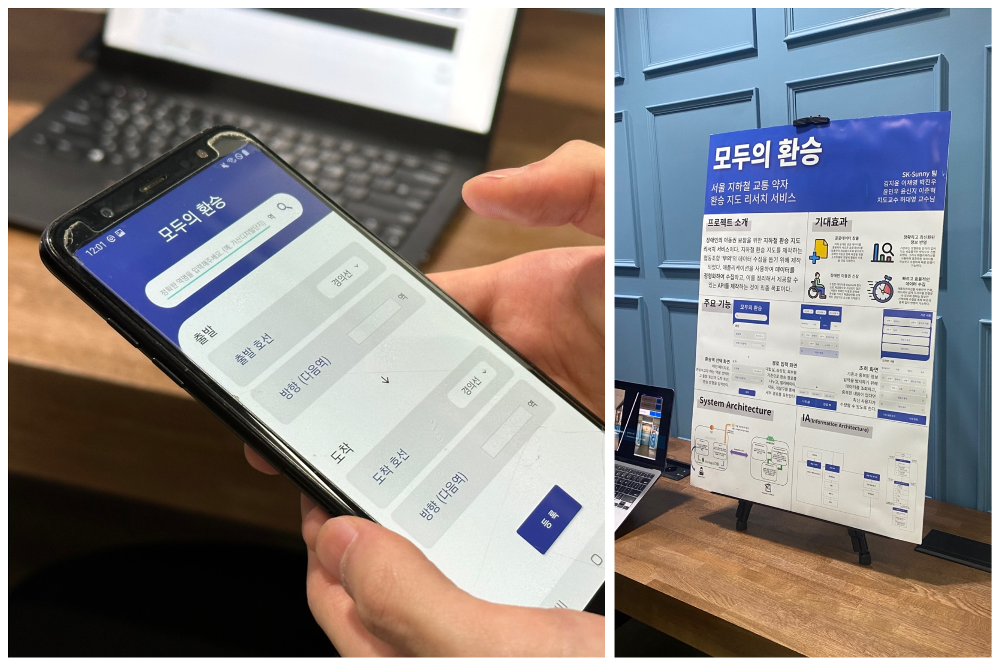
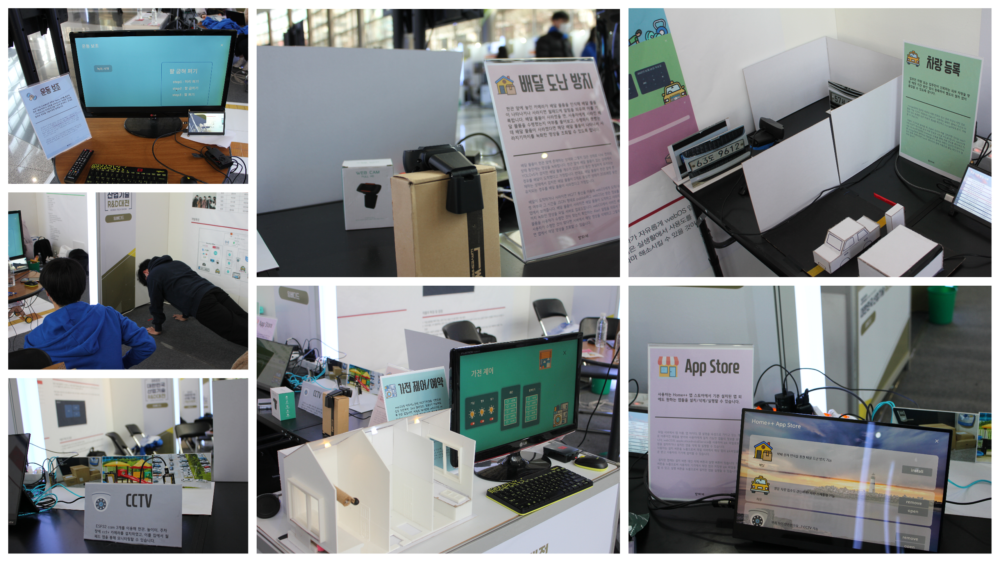

## Yun MinWoo's GitHub

  

👋🏻 Hi there!
I am a **Junior Developer** studying at **🎓 Department of Software at Kookmin University**.  

- 안녕하세요! **GitHub를 활용한 협업** 에 관심이 많고 **공부한 것을 활용하기 좋아하는** 주니어 개발자, **윤민우** 입니다.
    

### 💡 Career

🎓 2022.03.01\~0000.00.00 <a href="https://cs.kookmin.ac.kr/">Kookmin Univ. Department of Software</a>  
📖 2022.03.17\~0000.00.00 <a href="https://github.com/kmu-koss">KOSS</a>(KookminUniv. OpenSource Software Society)  
💻 2022.06.22\~0000.00.00 <a href="https://concat.kr/">CONCAT Inc.</a> (Backend InternShip -> Intern)  
 

### 🏆 Prize

🥈 2023.06.15~2023.12.01 **제17회 공개SW 개발자대회 학생부문 은상 - 한국정보과학회 회장상**

- Project : <a href="https://github.com/AgainIoT/Open-Set-Go">Open-Set-Go</a>
- Team : 또이오티
- Prize : 학생 부문 은상 - 한국정보과학회 회장상
- Contest : <a href="https://www.oss.kr/dev_competition">공개SW 개발자대회</a>
- Organization : 과학기술정보통신부(주최), NIPA-정보통신산업진흥원(주관)
- Sector : 자유부문 - 기타
   

🏆 2022.05.16~2022.12.15 **제20회 임베디드 소프트웨어 경진대회 전부문 대상 - 산업통상자원부 장관상**

- Project : <a href="https://github.com/ymw0407/2022ESWContest_webOS_3013">Home++ WallPad Platform</a>
- Team : 방파제
- Prize : 일반 부문 대상 - 산업통상자원부 장관상
- Contest : <a href="https://www.eswcontest.or.kr/">임베디드 소프트웨어 경진대회</a>
- Organization : 산업통상자원부(주최), KESSIA-임베디드소프트웨어·시스템산업협회(주관)
- Sector : <a href="https://www.webosose.org/">webOS</a> 부문 (LG전자 후원)
   

 

### 💻 Project

:octocat: 2023.07.05~2023.00.00 <a href="https://github.com/AgainIoT/Open-Set-Go">Open-Set-Go</a>

> It is a service that makes it easy and easy to start a complete open source project on GitHub by utilizing the Open Source Project Starter (WEB). I would like to operate it as an open source project.

- Role : PO & TA & Open-Source Manager & Backend Leader
- Tech : NestJS(TypeScript) & React(JavaScript) & Hugo & Route53 & Google Cloud Run & Netlify & Octokit.js & Shell Script
- Team : AgainIoT(또이오티)
- Organization : <a href="https://www.oss.kr/dev_competition">공개SW 개발자대회</a>
   

☀️ 2023.02.28~2023.06.02 <a href="https://github.com/AgainIoT/Everyones-Transfer_Main">모두의 환승(교통 약자 환승 지도 데이터 수집 솔루션)</a>

> It is an app for data collection of transfer maps for the transportation vulnerable in Seoul, allowing data to be collected in a standardized manner. The standardized data collected by the app is provided to developers for use as an Open API.

- Role : PM & Server & DB
- Tech : Node.js, Express.js, AWS EC2, MongoDB
- Team : <a href="https://www.notion.so/958a2687aa80433892dbfe08144ad725">AgainIoT(또이오티)</a>
- Organizatiopn : <a href="https://www.besunny.com/main.do">SK-Sunny capstone</a>
   

✈️ 2022.12.28~2022.12.29 <a href="https://github.com/F7W8">미래의 자신에게 보내는 편지, 마음 비행기</a>

- Role : Backend
- Tech : Nest.js, AWS EC2
- Team : F7W8
- Organization : COKOTHON(Hackathon)

📺 2022.05.16~2022.12.15 <a href="https://github.com/ymw0407/2022ESWContest_webOS_3013">Home++ WallPad Platform with webOS</a>

> It is a webOS wallpad platform that allows developers to develop and upload wallpad apps such as Google play and App Store. It provides Home++ stores, home appliance control apps, CCTV apps, home training apps, delivery theft prevention apps, and vehicle scheduling apps as basic built-in apps.

- Role : PO & Server & Service & Frontend & Hardware & Network
- Tech : Node.js & React.js & Express.js & Docker & AWS EC2 & MongoDB & Arduino & Blender(3D Printing) & Circuit & Raspberry Pi & webOS service(LS2 API) & Shell Script & Ubuntu OS
- Team : 방파제
- Organization : <a href="https://www.eswcontest.or.kr/">The World Embedded Software Contest 2022</a>

 

### 🧸 Toy Project

🐍 2023.06.15~2023.06.17 <a href="https://github.com/ymw0407/C-Snake-main">C Snake Game</a>

> It's a Snake game made in C++.

- Tech : C++
- Team : <a href="https://github.com/ymw0407/C-Snake-main">민우-신지-동현</a>
- Organization : C++ Programming lecture
   

💬 2023.03.09~2023.03.10 <a href="https://github.com/kmu-koss/SendSMS">동아리원 합격 발표를 위한 LMS 대량 발송 API 및 CSV 리딩 프로그램</a>

> It is designed to read the list of successful applicants in CSV files and to send LMSs in large quantities using NCP's Simple & Easy Notification Service.

- Role : Backend
- Tech : Simple & Easy Notification Service(Naver Cloud Platform) API & Python & Node.js & Express.js
- Team : Alone
- Organization : KOSS(KookminUniv. OpenSource Software Society)
   

 

### ⛳ Ongoing Project

_There are no projects scheduled yet._

 

### ✏️ Study & Peer Learning

🤖 2023.04.04~2023.06.14 <a href="https://github.com/kmu-koss/2023-1_IoT_Study">IoT Study</a>(Mentor)  

- Teach : Node.js & Express.js & MongoDB & Arduino & Raspberr Pi & Sensor & GitHub
   

🏫 2023.01.09~2023.01.12 <a href="https://github.com/ymw0407/YongMoon-Voluntary">YongMoon High School SW Education Volunteer</a>(Mentor)  

- Teach : HTML & CSS & JavaScript

🌐 2023.01.08~2023.03.01 <a href="https://github.com/ymw0407/Backend-study">Backend Study</a>(Leader)  

- Learn : Node.js & Express.js & Axios & GraphQL & Docker & Nest.js & TypeORM

🏫 2022.08.01~2022.08.04 YongMoon High School SW Education Volunteer(Mentor)

- Teach : HTML & CSS & JavaScript & Arduino ESP32-CAM

👨🏻‍🏫 2022.07.04~2022.08.26 <a href="https://github.com/kmu-koss/22_summer_bootcamp">IoT BootCamp</a>(Mentor)  

- Teach : Arduino & Raspberry Pi & PyQt

⚙️ 2022.03.17~2022.06.22 <a href="https://github.com/kmu-koss/22_iot_study">IoT Study</a>

- Learn : Node.js & Express.js & MongoDB & Arduino & Raspberry Pi & AOS

 

### ✨ Exhibition

📢 2023.06.03~2023.06.03 <a href="https://final.capstone.cs.kookmin.ac.kr/">2023 SW 다학제간캡스톤디자인 최종발표회(산학 참여)</a>

- Project : <a href="https://github.com/AgainIoT/Everyones-Transfer_Main">모두의 환승(교통 약자 환승 지도 데이터 수집 솔루션)</a>
- Organization : <a href="https://cs.kookmin.ac.kr/">국민대학교 소프트웨어융합대학</a>
- Location : 국민대학교 미래관 4층
- Period : 2023.06.03~2023.06.03  
  
   

📢 2022.12.07~2022.12.09 <a href="http://www.ktechshow.or.kr/">KOREA TECH SHOW 2022</a>

- Project : <a href="https://github.com/ymw0407/2022ESWContest_webOS_3013">Home++ WallPad Platform with webOS</a>
- Organization : <a href="https://www.eswcontest.or.kr/">The World Embedded Software Contest 2022</a>
- Location : COEX Hall B
- Period : 2022.12.07~2022.12.09  
  

### 📱 Blog & SNS

  

### ⭐ My Stat

 
 

 

 

 

 

 

