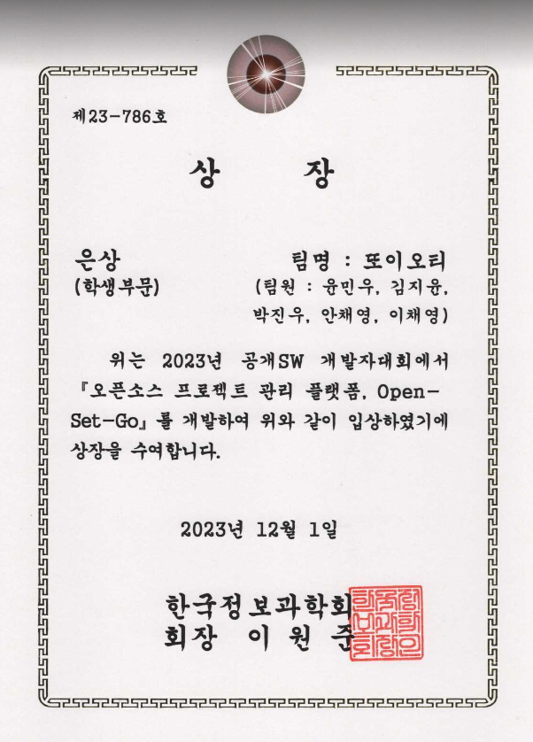
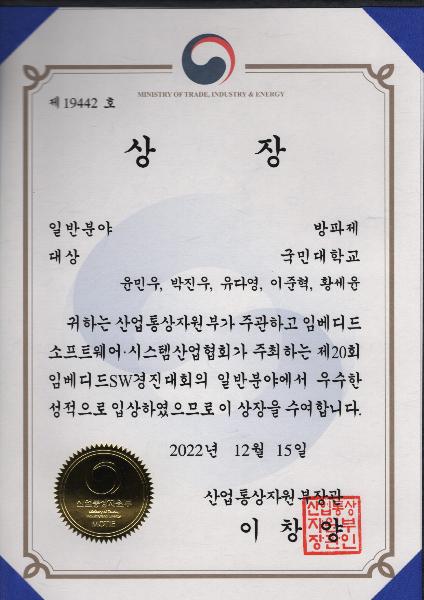
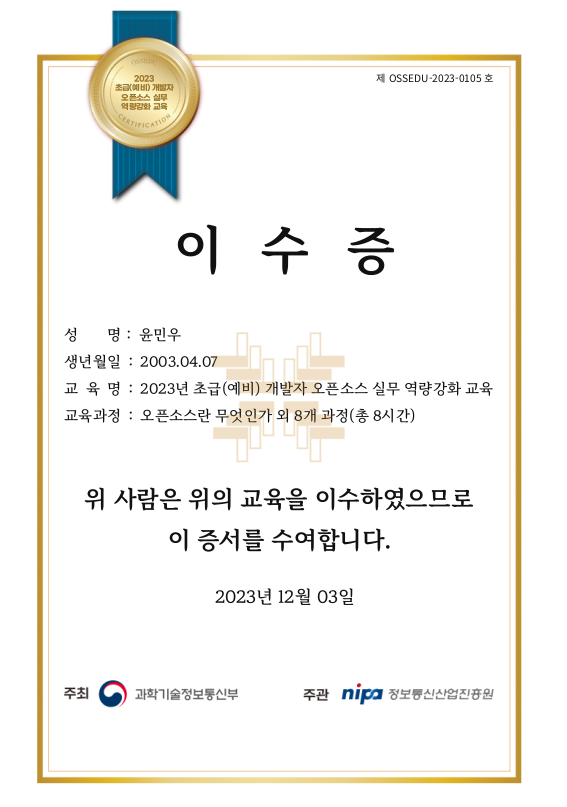

## 상장 / 자격증 / 수료증 / 이수증

### 상장

#### 제17회 공개SW 개발자대회(2023)

- 상명: 학생부문 은상
- 훈격: 한국정보과학회 회장상
- 대회: 제17회 공개SW 개발자대회
  - 주최: 과학기술정보통신부
  - 주관: 정보통신산업진흥원
  - 기간: 2023.06.15~2023.12.01
  - 참여 부문: 자유(기타)
  - 팀명: 또이오티
  - 팀원: **윤민우**(팀장), 안채영, 박진우, 이채영, 김지윤
  - 프로젝트: [Open-Set-Go](https://github.com/AgainIoT/Open-Set-Go)
- 기사:

#### 제20회 임베디드SW경진대회(2022)

- 상명: 일반분야 대상
- 훈격: 산업통상자원부 장관상
- 대회: 제20회 임베디드SW경진대회
  - 주관: 산업통상자원부
  - 주최: 임베디드소프트웨어·시스템산업협회회
  - 기간: 2022.05.16~2022.12.15
  - 참여 부문: webOS부문(LG전자 후원)
  - 팀명: 방파제
  - 팀원: **윤민우**(팀장), 박진우, 유다영, 이준혁, 황세윤
  - 프로젝트: [Home++ WallPad Platform with webOS](https://github.com/ymw0407/2022ESWContest_webOS_3013)
- 기사:
  - [webOS official blog] [The World Embedded Software Contest 2022](https://www.webosose.org/blog/2022/12/29/embedded-sw-contest-2022/)
  - [뉴스 와이어] [제20회 임베디드SW 경진대회 시상식 및 임베디드 소프트웨어 유공 포상 성료](https://www.newswire.co.kr/newsRead.php?no=958263)
  - [데일리 경제] [국민대 소프트웨어융합대학 동아리 코스, ‘제 20회 임베디드 SW 경진대회’ 대상ㆍ우수상 수상](http://www.kdpress.co.kr/news/articleView.html?idxno=117307)

### 자격증

_없음_

### 수료증

_없음_

### 이수증

#### 초급(예비) 개발자 오픈소스 실무 역량강화 교육(2023)

- 교육: 초급(예비) 개발자 오픈소스 실무 역량강화 교육
  - 주최: 과학기술정보통신부
  - 주관: 정보통신산업진흥원
- 교육과정: 오픈소스란 무엇인가 외 8개 과정(총 8시간)

